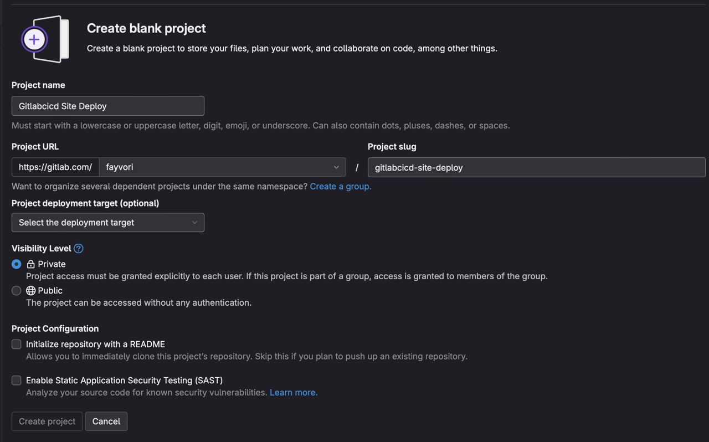
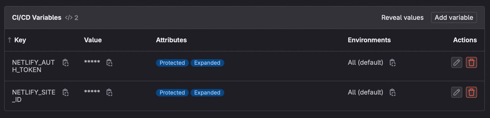

# Requirements
- Node
- Netlify account
- GitLab account
- Availible GitLab runner
- netlify-cli

# Implementation
First we need to create a new react app using `create-react-app` utility

// create-react-app image

**Also don't forget to create a new personal access token on netlify website [here](https://app.netlify.com/user/applications)**

After that create a new file inside app folder called `netlify.toml`. With following content:

```toml
[build]
  publish = "build"
```

The publish parameter represents our output folder after executing `npm run build` command.

Then we need to register our site on netlify site. I will process with command line. For register site on netlify run the following command inside app folder:

```bash
netlify sites:create -n YOU_DESIRED_SITE_DOMAIN (e.g. gitlabcicd-site-deploy)
```

Output should be like this:


And for now we are done with netlify part. Let's jump out into GitLab part!

Create a new gitlab repository as shown down below:



After that go to **Settings > CI/CD > Variables** and click *Add variable*. We need four variables in order to deploy our website to netlify `$NETLIFY_SITE_ID` `$NETLIFY_AUTH_TOKEN` `$DOCKER_USER` `$DOCKER_USER_PASSWORD`.



The next step is to set up out gitlab ci/cd pipeline. First create Dockerfile as shown below:

```Dockerfile
FROM node:18-alpine3.17 as build
WORKDIR /app

ENV PATH /app/node_modules/.bin:$PATH
COPY package.json /app/package.json
RUN npm install --silent
RUN npm install react-scripts -g --silent
COPY . /app
RUN npm run build

# production environment
FROM nginx:1.16.0-alpine
COPY --from=build /app/build /usr/share/nginx/html
EXPOSE 80
CMD ["nginx", "-g", "daemon off;"]
```

And now we can finally proceed to our `.gitlab-ci.yml` file

```yaml

```

Pipeline results
Ready to use site
? Notification